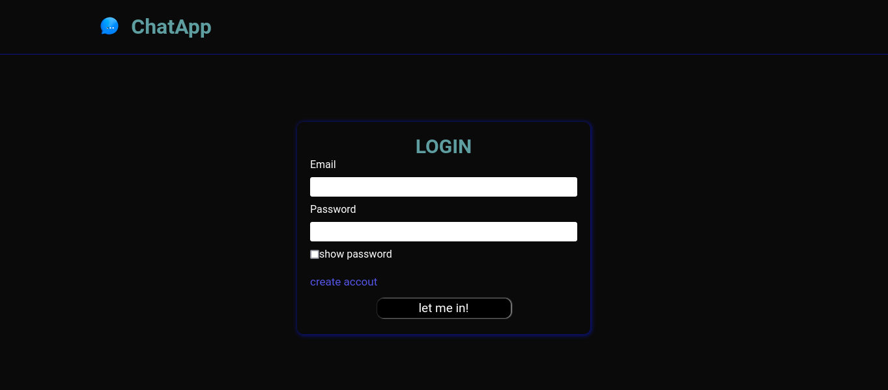
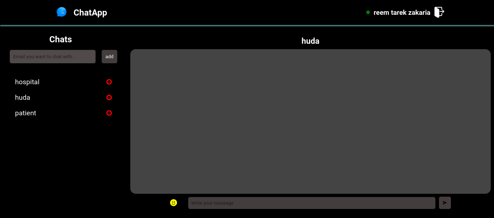

# Chat Application

A real-time chat application built with WebSockets.

## Table of Contents

- [Features](#features)
- [Demo](#demo)
- [Screenshots](#screenshots)
- [Technologies Used](#technologies-used)
- [Installation](#installation)
- [Usage](#usage)
- [Contributing](#contributing)
- [Contact](#contacts)

## Features

- Real-time messaging
- User authentication
- Private chats
- Easily accessed chatting platform
- Interactive user-interface

## Demo

Check out a live demo of the chat application: [https://chat-app-eta-sepia.vercel.app/]

## Screenshots

### Login Page



### Chat Interface



## Technologies Used

- Frontend: HTML, CSS, JavaScript, React
- Backend: Node.js, Express
- WebSockets: Socket.IO
- Database: PostgreSQL
- Authentication: JWT (JSON Web Tokens)

## Installation

### Prerequisites

- Node.js
- npm (Node Package Manager)
- PostgreSQL

### Steps

1. Clone the repository
   ```sh
   git clone https://github.com/reem2010/chatApp.git
   ```
2. Navigate to the project directory
   ```sh
   cd chat-application
   ```
3. Install dependencies
   ```sh
   npm install
   ```
4. Set up environment variables
   Create a `.env` file in the Backend root directory and add the following:

   ```env
   DATABASE_URL=your-PostgreSQL-uri
   SecretKey=your-secret-key
   HOST: 'http://localhost:5173'
   ```

   Create a `.env` file in the Frontend root directory and add the following:

   ```env
   VITE_Host='http://localhost:3000'
   ```

## Usage

1. Start the PostgreSQL server
2. Start the application
   ```sh
   npm start
   ```
3. Open your browser and navigate to `http://localhost:3000`

## Contributing

Contributions are welcome! Please fork the repository and submit a pull request.

1. Fork the Project
2. Create your Feature Branch (`git checkout -b feature/AmazingFeature`)
3. Commit your Changes (`git commit -m 'Add some NewFeature'`)
4. Push to the Branch (`git push origin feature/NewFeature`)
5. Open a Pull Request

## Contacts

Reem Tarek - [tarekreem950@gmail.com]
Reem Kamal - [reemkamal111@gmail.com]
Emil Dawood - [edawood997@gmail.com]

Project Link: [https://github.com/reem2010/chatApp]
